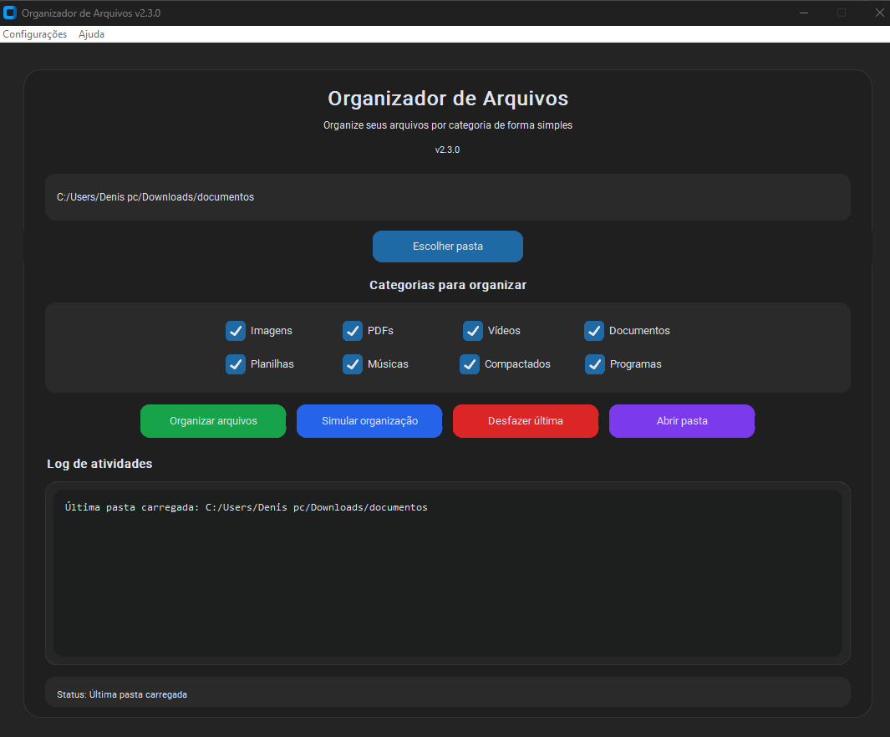

# Organizador de Arquivos (Python)

Fiz esse pequeno aplicativo em Python para organizar arquivos automaticamente por tipo dentro de uma pasta.

A ideia surgiu porque minha pasta de downloads sempre ficava bagunçada, então resolvi criar uma ferramenta simples para resolver isso.

## O que ele faz

- Organiza arquivos em pastas automaticamente
- Separa imagens, vídeos, documentos, músicas e outros tipos
- Cria as pastas caso elas não existam
- Evita sobrescrever arquivos com o mesmo nome
- Mostra um log do que está acontecendo
- Permite desfazer a última organização

## Como usar

1. Abra o aplicativo
2. Clique em **Escolher pasta**
3. Clique em **Organizar arquivos**

O programa vai separar automaticamente os arquivos nas pastas correspondentes.

## Tecnologias usadas

- Python
- Tkinter (interface gráfica)
- OS / Shutil para manipulação de arquivos
- JSON para salvar histórico

## Observação

Esse é um projeto simples que fiz para praticar Python e automação de arquivos.
